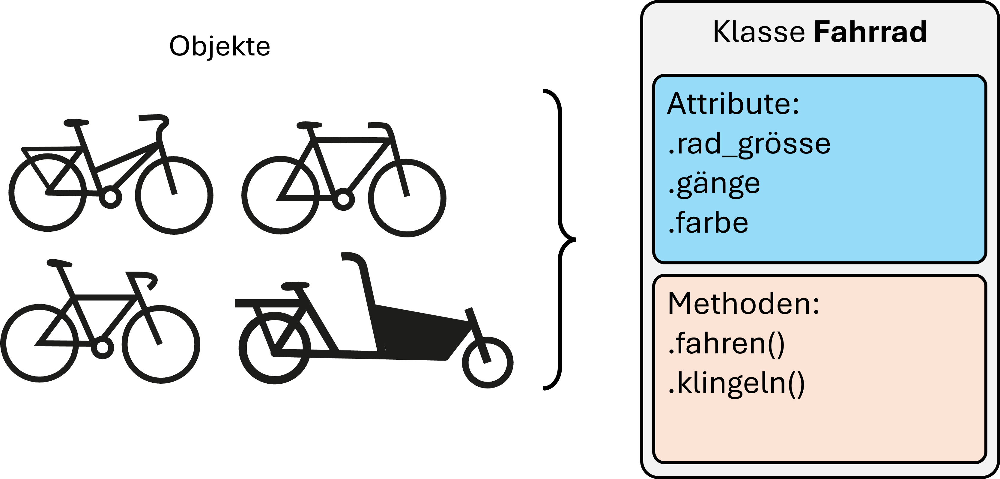

# Object-Oriented Programming - Introduction

## Introduction
Before we really get started with object-oriented programming (*OOP* for short), let's have a quick recap.

In the previous chapters, we explored ways to structure programs effectively. A key element in this is **functions**. Functions allow entire sections of a program to be encapsulated as independent sub-programs. This doesn’t always make the code significantly simpler, but it provides the program with a logical structure, allowing different aspects to be handled separately, improved, and extended.

**Side note:** In the context of functions, you may also hear the term **functional programming** ([Functional Programming](https://en.wikipedia.org/wiki/Functional_programming)). This doesn’t simply mean using functions (which is already standard practice) but rather a specific coding approach that places a strong emphasis on functions. This can include dynamically generating new functions, among other things.

## Object-Oriented Programming

Object-oriented programming (or "OOP") is a programming style, sometimes even referred to as a "programming paradigm," to indicate that it is about more than just small details—it represents a fundamental approach or perspective.

The original motivation behind object-oriented programming likely stems from its intuitive nature. That is, once you become familiar with its core principles...

In object-oriented programming, everything is described through **objects**. Objects have properties (the **attributes**) and capabilities or actions, known as **methods**. The important thing is that both attributes and methods come together in objects. For example, consider a bicycle: it has specific characteristics such as wheel size, color, and number of gears—these are the attributes. But a bicycle also has methods, such as riding or ringing the bell.



Right from the start, it's important to distinguish between two concepts that often cause confusion in the beginning: **Class vs. Object**.
A **class** defines a type; it serves as a kind of blueprint. An object (or **instance**) is an individual example based on a particular class. In our example, *Bicycle* is a class, while every real bicycle we see passing by is an object of the Bicycle class. None of these objects **is** a blueprint for bicycles, but they conform to the blueprint because they have the corresponding attributes and methods.

This also means: There is only **one Bicycle class**, but theoretically **an unlimited number of Bicycle objects**.

Confusing? Hopefully, it will become clearer soon.

By the way, besides using functions to structure a program, we have already worked with *methods*—without paying much attention to what methods actually are. We have encountered methods as functions that belong to specific data types. Let’s take lists as an example:

```python
numbers = [2, 5, 11, 3]
print(type(numbers))  # => <class 'list'>
```

Using `type()`, we see that numbers belongs to the class `list`. Like everything else in Python, numbers is an object.

We've seen that lists in Python come with a number of built-in methods, such as:

```python
numbers = [2, 5, 11, 3]
numbers.sort()
print(numbers)
```

Here, `.sort()` is a method. We don’t have to import it—it comes built into lists.

Similarly, other data types we’ve worked with, such as integers, floats, strings, dictionaries, and sets, also have methods.

## Defining a Class

A class allows us to define our own data types. Important: Classes are not specific to Python. Most modern programming languages allow you to define classes.

Let's start by defining a new data type, or rather, a new class called `Point()`:

```python
class Point:
    pass  # pass just means "do nothing"

a = Point()
print(a)  # => <__main__.Point object at 0x000001F9DB02BDC0>
```

We define a new class in Python using `class`. Class names follow similar naming conventions as variables, but to distinguish them from variables and functions, class names typically follow the CamelCase convention, where each word starts with a capital letter: `MyClass`, `DoesWhatYouWant`, etc.

An object (i.e., an instance of a class) is created just like calling a function, e.g., `a = Point()`. Now, `a` is an object of the class `Point`. We can confirm this using `type()`.

A class contains attributes and methods. Attributes are similar to variables, and—as mentioned earlier—methods are similar to functions. Both are accessed using . notation. Let’s start with attributes.

### Attributes & Methods

Attributes can be added or modified freely. Objects are mutable, meaning we can adjust their attributes:

<!-- pytest-codeblocks:cont -->

```python
point1 = Point()
point1.x = 4
point1.y = 3
print(point1.x, point1.y)  # => 4 3

point1.x = 0
print(point1.x, point1.y)  # => 0 3
```

Now, let's add our first method to `Point`:

```python
class Point:
    def position(self):
        print(self.x, self.y)
        
point1 = Point()
point1.x = 4
point1.y = 3
point1.position()
```

However, if we try the following:

<!-- pytest-codeblocks:expect-error -->

```python
point2 = Point()
point2.position()  # => AttributeError: 'Point' object has no attribute 'x'
```

`point2` is a new instance of the `Point` class. The method `position()` exists, but the attributes `x` and `y` have not been defined yet, leading to an error.

Ideally, every `Point` object should always have an x and y position. This is possible using an initializer method, also known as a constructor. In Python, we use the `__init__` method for this:

```python
class Point:
    def __init__(self, x, y):
        self.x = x
        self.y = y

    def position(self):
        print(self.x, self.y)

point1 = Point(10, 3)
point1.position()  # => 10 3
```

OK. Short mini-quiz:

> ### Quiz!
>
> In Python, “my name is”... : (select all applicable answers)
>
> A) ... an instance.
> B) ... a class.
> C) ... an object.
> D) ... a function.

and

> Next question: “my name is” is...
>
> A) an object of the class 'str' (string)
> B) an object without class
> C) an object of the class 'type'

Let's continue... 

Now the class Point should get another method to measure the distance from the center point (0, 0).

```python
import math

class Point:
    def __init__(self, x, y):
        self.x = x
        self.y = y

    def position(self):
        print(self.x, self.y)

    def center_distance(self):
        return math.sqrt(self.x ** 2 + self.y ** 2)

a = Point(4, 3)
print(a.center_distance())  # => 5.0
```

### One class, an infinite number of objects

Any number of objects of a class can be created. The class always remains the same. And all objects of the class (i.e. all objects created using the same class) have the same methods.

<!-- pytest-codeblocks:cont -->

```python
from random import randint

for _ in range(10):
    new_point = Point(randint(-10, 10), randint(-10, 10))
    point_collection.append(new_point)

for point in point_collection:
    point.position()
```

The list `point_collection` then contains 10 `Point` objects, which all have the same methods and therefore all have the attributes x and y, but which can all have completely different values for x and y.


### Objects that contain other objects (“composition”)

As we have just seen, we can create any number of instances of a class (=objects). Different classes are often defined for different tasks or data types. However, these can interact with each other in a variety of ways.

One possibility is that a class accesses other classes. Let's imagine, for example, that we want to create a Triangle class. Then this class could use our 'Point' class defined above as corners.

<!-- pytest-codeblocks:skip -->

```python
class Triangle:
    def __init__(self, corners):
        self.corners = dict()
        for i, (x, y) in enumerate(corners):
            self.corners[i+1] = Point(x, y)

tri_1 = Triangle([(0, 0), (15.5, 7), (-1, -2)])
tri_1.corners[2].position()  # --> 15.5 7
```


### Methods that use objects

Just as with `__init__`, or just as with functions, methods can use any arguments (not just `self`). These can be any data types such as List, Set, Dictionary etc. or even objects of classes we have defined ourselves. Objects of the same type can even be used as arguments. For example, if we want to calculate the distance from one `Point` object to another `Point` object:

```python
import math

class Point:
    def __init__(self, x, y):
        self.x = x
        self.y = y

    def position(self):
        print(self.x, self.y)

    def center_distance(self):
        return math.sqrt(self.x ** 2 + self.y ** 2)
    
    def distance_to_point(self, point):
        dist_x = self.x - point.x
        dist_y = self.y - point.y
        return math.sqrt(dist_x ** 2 + dist_y ** 2)

a = Point(4, 3)
b = Point(-7, 8)
print(a.distance_to_point(b))  # => 12.083045973594572
```

Another example in which we define a class `Fruit`. We then use it to create various `Fruit` objects.

<!-- pytest-codeblocks:cont -->

```python
class Fruit:
    def __init__(self, name,
                 good_for=[]):
        self.name = name
        self.good_for = good_for

    def juice(self):
        if "juice" in self.good_for:
            print(f"Voilà! {self.name} juice!")
        else:
            print(f"{self.name} juice? Better not.")


apple = Fruit("apple", good_for=["juice", "cake"])
apple.juice()

banana = Fruit("banana", good_for=["cake"])
banana.juice()
```

Super. 

We can now define our own classes. 

So what? What's the point of that anyway?

Quite a lot! On the one hand, classes help to structure programs in a meaningful way, because with classes we can design objects in such a way that they have exactly the desired properties and are equipped with all the necessary methods. In our first example, for example, we have ensured that all 'point' objects have an x-y position. And we can use the corresponding methods for all of them without any extra import, here it was `center_distance()`.

